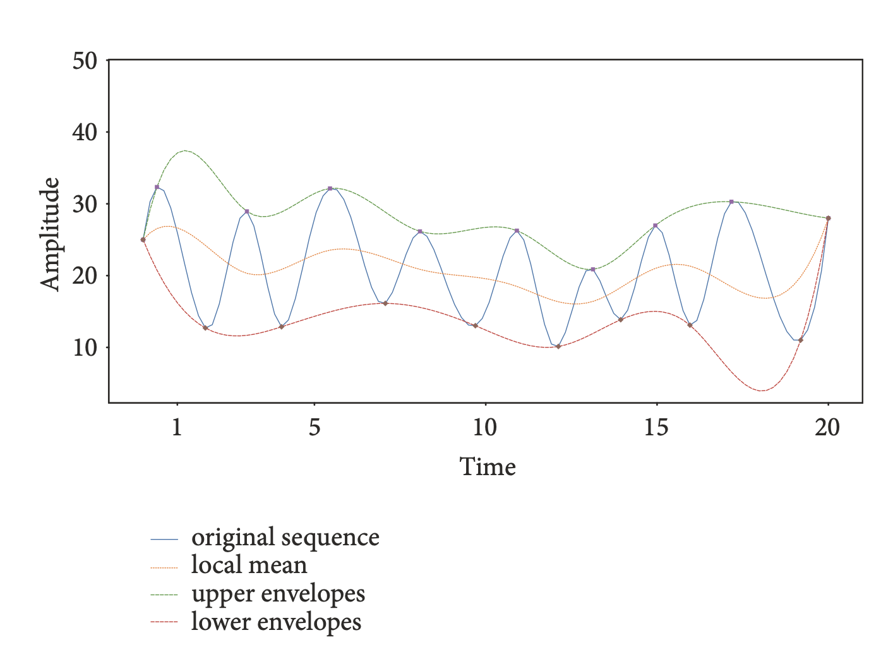
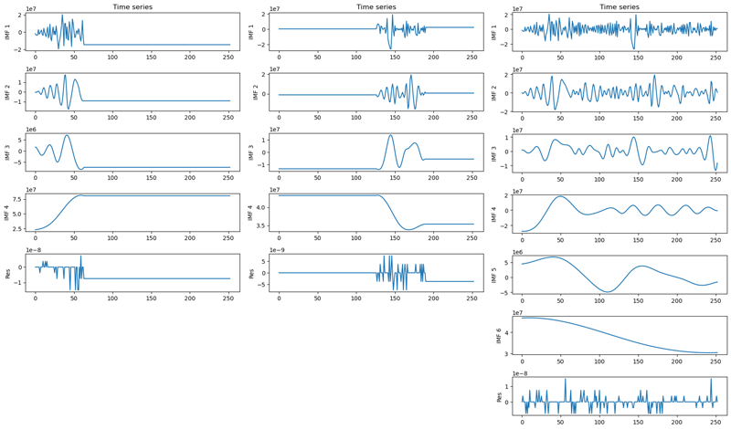
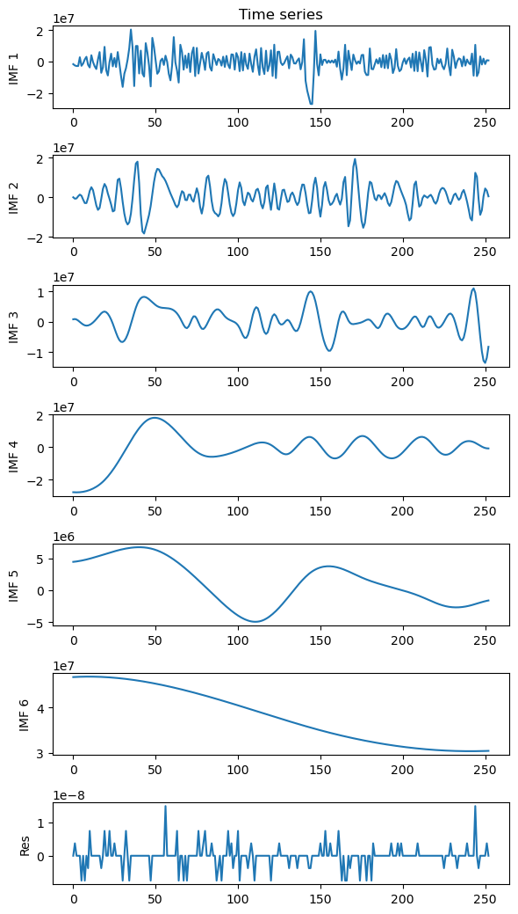
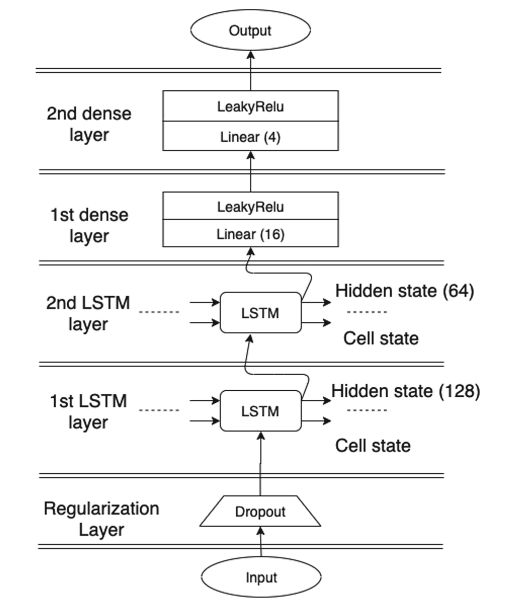
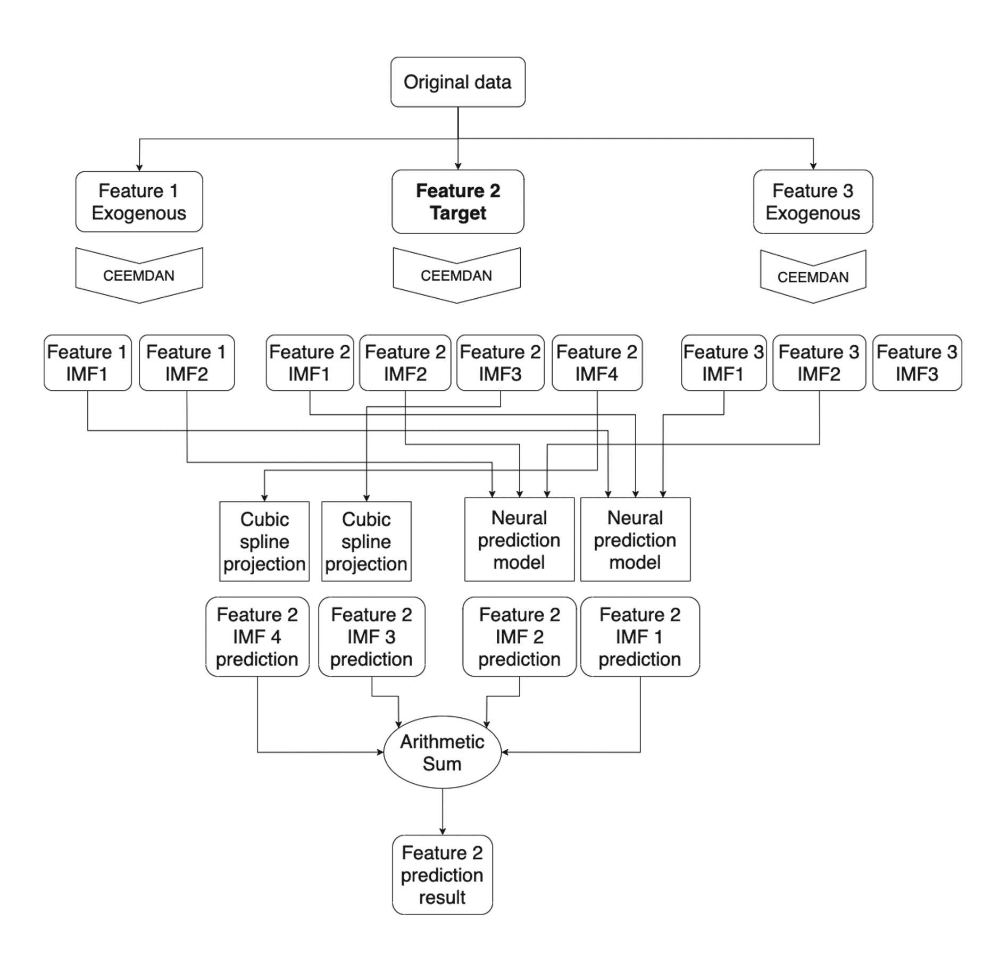

## Table of Contents
<ol type="1">
    <li><a href="#1">Introduction</a></li>
    <ul>
        <li><a href="#1.1">1.1 Background</a></li>
        <li><a href="#1.2">1.2 Audience & Motivation</a></li>
    </ul>
    <li><a href="#2">Data Acquisition</a></li>
    <ul>
        <li><a href="#2.1">2.1 Data Sources</a></li>
    </ul>
    <li><a href="#3">Methodology</a></li>
    <ul>
        <li><a href="#3.1">3.1 Data Cleaning / Splitting</a></li>
        <li><a href="#3.2">3.2 Feature Engineering</a></li>
        <li><a href="#3.3">3.3 Scaling</a></li>
        <li><a href="#3.4">3.4 Feature Importance & Dimensionality Reduction</a></li>
        <li><a href="#3.5">3.5 Unsupervised Learning Stock Picks</a></li>
        <li><a href="#3.6">3.6 Forecasting Models</a></li>
    </ul>
    <li><a href="#4">Results & Discussion</a></li>
    <ul>
        <li><a href="#4.1">4.1 Forecasting Numerical Results</a></li>
        <li><a href="#4.2">4.2 Back Testing Results</a></li>
        <li><a href="#4.3">4.3 Discussion & Failure Analysis</a></li>
    </ul>
    <li><a href="#5">Conclusion & Future Direction</a></li>
</ol>
    
## 1. Introduction
### 1.1.Background
Financial time series analysis and forecasting have had several approaches over time. Many scholars and teams of professionals have devoted their life’s work to trying to forecast stock prices accurately. The traditional models follow a stochastic probabilistic approach, while more recent models are based on machine learning methods. Currently, the most widely used approaches to forecasting can be roughly divided into two groups: statistical approaches and artificial intelligence approaches. 

The traditional statistical models arose in the beginning of the last century with Yule and Walker, who proposed the autoregressive model (AR)  describing linear relations between past and future values. After that, Whittle showed better results by also considering moving averages, extending the AR model into ARMA. Then, Box and Jenkins proposed a method to estimate ARMA coefficients and they also popularized model variations including seasonality and integrality (ARIMA and SARIMA). More advances on explaining and predicting time series are Engle’s results for modelling time series volatility and Hamilton’s cointegration theory. These approaches were very successful to explain time series based on a priori hypothesis, generating a single model that can be applied to circumstantial situations. However, although statistical approaches improve the accuracy of forecasting stock prices to some extent, the assumption of linearity of stock prices cannot be met according to some recent research, and hence it limits the accuracy. 

More recent models try to focus on learning the behavior of a series from its data, without prior explicit assumptions, such as linearity or stationarity. This approach makes it possible to use machine learning and signal processing techniques with less financial market singularities, for instance market’s liquidity, volatility or efficiency. Therefore, a variety of Machine Learning (ML) and Artificial Intelligence (AI) approaches have been proposed to capture the nonlinearity and nonstationarity of stock prices in the last decades. These models are a hybrid combination of neural network models, traditional models and signal processing. This last element is responsible for decomposing or filtering a time series prior to the model fitting. 
    
### 1.2 Audience Motivation
We conducted an empirical survey of these distinct approaches to forecasting stock prices on a daily scale. Specifically we forecasted using: Auto Regression (AR), ARIMA, SARIMA, Linear Regression, Random Forests, XGBoosted Decision Trees, and various Deep Neural Network LSTM ensembles. We also explored training these models using 363 features that leverage fundamental and technical information. The motivation for this effort is to be able to articulate the nuanced trade-offs and impact that decisions about feature engineering, signal processing, model complexity, model interpretability have on numerical accuracy and the resulting forecast's potential to create value.
    
## 2.Data Acquisition
### 2.1 Data Sources
For our initial dataset, we use yfinance for daily pricing data, and Nasdaq (formerly Quandl) for fundamentals data. We obtain a dataframe with one time series for each of the features, for each of the companies we are working with. The daily pricing data includes 5 columns containing pricing information for each company: Open, High, Low, Close, Volume. This is standard ticker (stock) data that is easily accessible through the yfinance library. The fundamental data is a proprietary dataset that is available through https://data.nasdaq.com/databases/SF1/data, containing 20 years of data with 150 fundamental indicators for over 14,000 companies. For our initial dataset, we gathered 104 fundamental indicators along with the 5 standard price indicators.  We take the fundamental and yfinance data and join the data based on the current S&P 500 companies to reduce the size. 

## 3. Methodology
### 3.1 Data Cleaning & Splitting
**Splitting the data**
The test-train split for modeling was 80-10-10, representing 80% (4336 days) training data, 10% (542 days) validation data, and 10% (542 days) final holdout test data. The decision to leave cross validation out was due to the relatively low number of data instances compared to using higher frequency data. If using higher frequency data with a similar target, we would be able to benefit from a windowed time series cross validation and achieve more robust results. Since we only tested results on the last 20% of the data, our models may perform worse if there is a regime change. In other words, if the distribution of the features drastically changes during a new time period, our current models would not be robust to those new distributions.
    
### 3.2 Feature Engineering
**Feature Engineering to Create Technical Features**
    
In order to create additional features on top of our core pricing and fundamental data, we used a Python technical analysis library, https://github.com/bukosabino/ta, to help engineer our remaining features. We used rolling windows of 6, 18, 24, 30, 50, 100, and 200 days for each technical indicator in our list. In total, we created an additional 254 technical features, which amounted to 363 combined price features that reflected volatility, momentum, volume, and trend to use for modeling. We trained each model on the same length of data instances, which is 5419 trading days in total. 
    
**Technical Feature Descriptions**

***Relative Strength Index (RSI) momentum indicator***

Relative Strength Index is a momentum indicator that tracks the magnitude of recent price changes. The recency component, as well as the ability to include magnitude, means the indicator can evaluate overbought/oversold conditions quickly, despite being a lagging indicator. The indicator is an oscillator (ranges between two values) and often has cutoffs at 80% (overbought) and 20% (oversold), though you may find these as a 70/30 split as well. Our combination list iterated over the lookback period length. 

More information: [https://www.investopedia.com/terms/r/rsi.asp](https://www.investopedia.com/terms/r/rsi.asp)
    
***MACD trend-following momentum indicator***
    
MACD (Moving Average Convergence Divergence) is a lagging trend-following momentum indicator. This indicator leverages two different moving averages for a ticker’s price, where one is slower and one is faster, and the difference is taken between the two to determine the MACD line. There is also a signal line, typically faster than the faster of the moving averages, which acts as an indicator for buys and sells. When the MACD line passes above the signal line, the security is considered a Buy. Our combination list iterated over the short and long lookback period lengths,  where the faster is less than the slower length. Our feature metric is the difference between these two, for some normalization around 0. 

More information: [https://www.investopedia.com/terms/m/macd.asp](https://www.investopedia.com/terms/m/macd.asp)
    
***Bollinger Bands (BB) volatility indicator***
    
Bollinger Bands are a volatility indicator that leverages standard deviations of volatility to identify two bands - one above and one below the SMA for price movement - for what would be reasonable volatility ranges. This is a way to identify overbought/oversold conditions (where above the higher band is overbought, below the lower band is oversold). In more volatile markets, bands widen; in less volatile markets bands contract. Our combination list iterated over the lookback period length, a traditional, uniform 2 standard deviations were used throughout all iterations, and the indicator returned both band values, as well as a binary 0/1 for both high and low bands as to whether the price movement had crossed it, providing a normalized value across securities.

More information: [https://www.investopedia.com/terms/b/bollingerbands.asp](https://www.investopedia.com/terms/b/bollingerbands.asp)
    
***On-Balance Volume (OBV) volume indicator***
    
On-Balance Volume is a technical momentum indicator that uses volume to predict stock price changes. Volume can be a strong indicator of momentum, in that significant volume flows and changes can mean a material price change with “stickiness”. If volume increases significantly with no immediate stock price chance, that means that the change is likely about to happen. Based on today’s closing price in relation to yesterday’s closing price, we can also assign direction to this indicator (bearish/bullish). OBV does not require a window, as it is a running summation of volume.

More information: [https://www.investopedia.com/terms/o/onbalancevolume.asp](https://www.investopedia.com/terms/o/onbalancevolume.asp)
    
***Average True Range (ATR) volatility indicator***
    
Average True Range is a volatility indicator that decomposes the price range movement for a lookback time period. The ATR is a moving average of the true ranges, defined as the maximum of three different range-related values. Our combination list iterated over the lookback period length of this moving average window.

More information: [https://www.investopedia.com/terms/a/atr.asp](https://www.investopedia.com/terms/a/atr.asp)
    
***Stochastic Oscillator (SR) momentum indicator***
    
A stochastic oscillator is a momentum indicator that compares closing price to a factor of high and low price ranges over a lookback window. The indicator is an oscillator, indicating it is range-bound, bouncing between a range of 0-100. It specifically indicates overbought/oversold conditions. Our combination list iterated over the lookback period length.

More information: [https://www.investopedia.com/terms/s/stochasticoscillator.asp](https://www.investopedia.com/terms/s/stochasticoscillator.asp)
    
***Volume-Price Trend (VPT) volume indicator***
    
Volume-Price Trend is a volume indicator that helps identify price direction and the magnitude of that movement. It is specifically used to determine supply and demand of a security. Like On-Balance volume, the VPT consists of a cumulative volume trend line, though leveraging a multiple of the percentage change as opposed to flat volume count, as well as a smoothed moving average of that line. VPT does not require a window.

More information: [https://www.investopedia.com/terms/v/vptindicator.asp](https://www.investopedia.com/terms/v/vptindicator.asp)

***Accumulation/Distribution Index (ADI) volume indicator***
    
Similarly to Volume-Price Trend, ADI is a volume indicator that uses a money flow multiplier and volume to determine supply and demand of a security. The money flow multiplier is a percentage derived using differences in high, low, and close prices for the period. ADI does not require a window. 

More information: [https://www.investopedia.com/terms/a/accumulationdistribution.asp](https://www.investopedia.com/terms/a/accumulationdistribution.asp)

***Chaikin Money Flow (CMF) volume indicator***
    
Chaikin Money Flow is a volume indicator that is an oscillator. It operates under the assumption that values above zero indicate strength, and values below zero indicate weakness in a security’s price. The CMF is similar to ADI, except that it leverages a lookback window to create a moving average and generates a signal line with this. Our combination list iterated over the lookback period length of the moving average window.

More information: [https://www.fidelity.com/learning-center/trading-investing/technical-analysis/technical-indicator-guide/cmf](https://www.fidelity.com/learning-center/trading-investing/technical-analysis/technical-indicator-guide/cmf)
    
***Ichimoku Kinko Hyo trend and momentum indicator***
    
Ichimoku is a trend and momentum indicator that is used to determine support and resistance levels. There are five parts to the Ichimoku Kinko Hyo, each determining something important about the stock’s movements. These lines create a combination of moving averages of highs, lows, closes, divergences, and convergences that generate insight to lines of support and resistance, as well as crossovers. Our combination list iterated over the three possible window lookback period lengths,  where the faster is less than middle, is less than the slower length. Our feature metrics related to Ichimoku are the values of the conversion lines, values of the base lines, and the differences between those two for some normalization around 0.

More information: [https://www.investopedia.com/terms/i/ichimokuchart.asp](https://www.investopedia.com/terms/i/ichimokuchart.asp)
    
***Donchian Channel volatility indicator***
    
The Donchian Channel is a volatility indicator that comprises three lines, where one is a moving average and the other two are bands. The upper band is the highest price of a security over a lookback period, and the lower band is the lowest price of a security during that same period. A breakthrough in either direction indicates strong volatility and momentum in those directions. Our combination list iterated over the lookback period length.

More information: [https://www.investopedia.com/terms/d/donchianchannels.asp](https://www.investopedia.com/terms/d/donchianchannels.asp)
    
***Simple Moving Average (SMA)***
    
A simple moving average is a trend indicator, and is just the arithmetic mean of the price over a particular lookback period.

More information: [https://www.investopedia.com/terms/m/movingaverage.asp](https://www.investopedia.com/terms/m/movingaverage.asp)
    
***Exponential Moving Average (EMA) trend indicator***
    
An exponential moving average is a trend indicator, and is a weighted average of the price over a particular lookback period that takes recency into account, and is thus more responsive to new information in pricing changes. 

More information: [https://www.investopedia.com/terms/m/movingaverage.asp](https://www.investopedia.com/terms/m/movingaverage.asp)
    
**Fundamentals (General)**
   
Fundamentals are a category of metrics that are not necessarily indicators for pricing movements, but can have an influence on price. Fundamentals are taken from the company’s public reporting documents, including their income statements, cash flow statements, and balance sheets. There are metrics in our raw dataset that are nominal for each company, but some ratios, such as P/E, P/B, etc.,  that are also normalized in some capacity to compare to other companies, despite significant changes in the value of a dollar over the 20 year period. 

The inclusion of fundamentals alongside technical indicators is the hope that aspects of the company’s underlying workings and fundamental value may lend some insight into its pricing and movements. The difficulty here is that these reports come out quarterly, and some stats are updated yearly, while technical indicators are different daily. So, this slower updating of information and subsequent feed-through to price may lead this subset to have less feature importance against a target with daily movement.
    
**Signal Processing: Decomposition Features**
As mentioned, in the last decade there has been a focus on a hybrid combination of neural network models and signal processing to capture the nonlinearity and nonstationarity of stock prices. Here the original time series is decomposed into several components. We leveraged the Complete Ensemble Empirical Mode Decomposition with Adaptive Noise (CEEMDAN) to decompose our nonlinear, nonstationary sequences into intrinsic mode functions (IMFs) in the spirit of the Fourier series. In contrast to the Fourier series, they are not simply sine or cosine functions, but rather functions that represent the characteristics of the local oscillation frequency of the original data.

 ***CEEMDAN IMF calculation components***

***Data Leakage Investigation***
We noticed that researchers using CEEMDAN have been decomposing an entire time series before splitting into train, validation, and test sets. The conceptual exploitation here is that CEEMDAN is a localized calculation finding the mean, upper, and lower functions of the frequencies and therefore data leakage is not an issue. Being defensive about data leakage we tested this by performing CEEMDAN on different subsets of a time series. In the end, we observed that IMF1 & IMF2 empirically don’t afford data leakage, a contradiction of the strict rhetoric of processing after splitting. This was quite intriguing when considering that the best performing models from our investigation only used IMF1 + IMF2 as features and then did spline modeling to replace the remaining IMFs. 

While validating our decomposition methodology we also empirically observed that the decomposition normalized our upward trending features  in such a way that we could also min-max scale our data without being concerned about data leakage. 

 ***Feature decomposition from different time-series cuts: MSFT 2020***

**Target Feature**

At first we explored forecasting the next day closing price directly. However, we found that target variable to be quite noisy. Intuitively you may consider that the end of the day is a random moment that closes the time series amid fluctuations and therefore has the noise of randomness attached to it. So instead we found more stable results with log return from close to next day high as the target variable. This can be described as 𝑙𝑛 (next day high / current close). The reasoning behind normalizing the next-day target by current close was to allow the models to learn meaningful information from the training data. For each ticker in the S&P 500, there is a significant upward shift in prices over the last 10 years. Normalizing each 1-day high target by the current close keeps the target range-bound to log return of day to day movements, making the target easier to scale. Since the training data accurately represents the distribution of daily close-to-high movement, we are able to compute a minmax scaler using only the training data and apply it to the remaining test data.

Additionally, this target feature reduces noise that exists in close-to-close or high-to-high trends, and lends itself to a more practical application in trading for alpha. For example, if the high price prediction for tomorrow’s trading day is higher than today’s close, we have an opportunity for a return, regardless of whether the close is up or down from today.

### 3.3 Feature Scaling

In the end we opted for the most widely used financial time-series scaling method, min-max scaling. The main caveat of using the min-max normalization method in time series forecasts is that the minimum and maximum values of out-of-sample data sets are unknown. Our mitigation strategy was normalizing our target variable using log return, which bounded our target feature. It is worth noting that this out-of-sample concern can also be mitigated by decision trees. A key benefit to decision trees is that one does not have to worry about scaling the Independent variables (features). 

### 3.4 Feature Importance & Dimensionality Reduction

The best parameter tuned models for each stock were then used to compute feature importance with TreeSHAP, a game theoretic algorithm that computes Shapley Additive Explanation values for tree ensembles. The goal of SHAP is to explain the prediction of an instance x by computing the contribution of each feature to the prediction. TreeSHAP defines the value function using the conditional expectation instead of the marginal expectation like the other SHAP variants. A full detailed description on TreeSHAP and SHAP (SHapley Additive exPlanations) can be found at https://christophm.github.io/interpretable-ml-book/shap.html#treeshap. We averaged the top 50 most important features per stock and combined them to reduce the feature space from 363 to 50. Reducing the feature space has the distinct benefit of aiding in convergence by separating noisy features for downstream model training. It is worth noting that many of the top 50 features are long-term technical indicators, with many of them having a moving window of 200 days. This is partly due to the fact that large changes in the longer-windowed features indicate a significant change in momentum, volatility, volume, and/or trend of the underlying stock. 

 ***The following is the top 50 average feature importance across all stocks***

### 3.5 Unsupervised Learning Stock Picks
In a conscious effort to test the robustness of forecasting techniques we did not simply choose stocks of interest––sexy stocks. Instead we chose stocks with different time series characteristics so that we had the opportunity to observe how different time series characteristics might favor different modeling techniques. To do this we took the following 8 steps:

1. Select the last 120 days of 2021 in our data.
2. MinMax Scaled on technical features of interest ('Open', 'High', 'Low', 'Volume', 'Adj Close').
3. Implemented signal processing by CEEMDAN, decomposition, so that we could cluster on the extracted time series characteristics.
4. Then we converted them into TSLearn’s time series format for time series K-Means clustering.
5. Using Dynamic Time Warp (DTW) as a distance metric exploring  6-25 clusters.
6. Using cluster inertia we selected 20 clusters as optimal.
7. Finally we created dissimilarity matrix using DTW for selecting a stock within each cluster. Using idxmax we then found the largest dissimilarity between each stock and chose the largest dissimilarities between clusters.
8. This led us to choosing tickers: MSFT, HD, UNH, XOM, ADSK, WAT.

The final stocks in this list are Microsoft (Software-Infrastructure), Home Depot (Consumer), United Health Care (Healthcare), XOM (Energy), Autodesk (Software-Application), and Waters Corporation (Healthcare). Note that the last two stocks in this list, ADSK and WAT, had a very low similarity score with the other stocks. These stocks seem to have more noise in their day-to-day movements when compared to the other stocks in the analysis.

### 3.6 Forecasting Models

**XGboost Model**

Models were trained using MSE as the loss metric. A grid search method was used to find models per stock that had the highest r^2 value on the validation data, which gave us the best parameters per model to use for each stock in the analysis. The grid-searched parameters for each stock include colsample_bytree, gamma, learning_rate, max_depth, and n_estimators. Additionally, the best performing models were used to create SHAP feature importance values, which were then used to create an average feature importance score per stock. A dataset containing the top 50 features across all stocks was created to reduce the size and noise of the original dataset. 

**Random Forest Model**

Random Forest is a model that combines multiple decision trees in order to determine the final result, as opposed to an individual tree, to reduce model variance. We used the reduced dataset of 50 of the most important features (as determined by TreeSHAP) to reduce computational time and noise. This means our independent variables were all of the 50 important features, while our dependent (output/target) variable was our defined target of 1-day close-to-high log return.
Given the amount of parameters that can be changed in a random forest model, we leveraged a grid search method to run different combinations of ‘n_estimators’ and ‘max_features’ on the validation set, and the result with the highest model score was kept. The test set was then run through Random Forest with these parameters

**Linear Regression**

Linear regression is the most basic machine learning algorithm we used in this project to predict prices. Since a linear regression simply calculates the equation that determines the relationship between independent and dependent variables, there are no real parameters to test out here. We ran the regression on the validation set, and then the test set. 

**AR Model Selection**

Autoregression as a modelling technique that leverages observations at adjacent time steps. This means that previous time steps inform the dependent variable (future price prediction). The target variable that we used was 1-day close-to-high log return, so we are effectively predicting the percentage log change between today’s close and tomorrow’s high, which through the model pipeline will be converted into tomorrow’s high prediction. We leveraged the first-order differential (d=1) in this model.

The AR models were trained using RMSE as the loss metric on the validation set, iterating through various p (number of time lags) to minimize loss. The resulting best (least) loss metric was used for the model on the validation set, which varied by stock. The model was then run with the same parameters as the validation set set on the test set

**ARIMA Model Selection**

Similarly to AR, ARIMA leverages observations at adjacent time steps. One of the most important aspects of ARIMA is the need for stationary data. And here we are answering the question of what does that mean for numerical accuracy if the time series is not stationary. Our data has already been adjusted to where our target variable that we are predicting is the 1-day close-to-high log return, so from here we run an Augmented Dickey-Fuller test on the data to verify whether or not the data is stationary at this juncture. We also must address potential seasonality, given the cyclicality that can exist in securities prices.

Fortunately, there is a pre-built library called pmdarima containing a function called .auto_arima(), which allows us to perform differencing tests (like ADF) to determine order of differencing, d, and then fitting models within starting p, max p, starting q, and max q ranges for the “optimal” parameters for an ARIMA model. A seasonality option can also be enabled, which we did here given yearly trends in financial data.

The .auto_arima() model determined that SARIMAX, a Seasonal ARIMA model with “eXogenous factors” would be the ARIMA model that fit best, and parameters varied by stock. The optimal model and parameters were extracted from the optimization function’s outputs, and the model was rerun under those parameters. The model was then run on the test set for an unbiased, leakage-proof result. We used first-order differencing on each model, resulting in extremely similar results to AR.

**LSTM: Deep Neural Network**

As previously mentioned, more recent models try to focus on learning the behavior of a series from its data, without prior explicit assumptions, such as linearity or stationarity. An ideal approach is to divide the tough task of forecasting the original time series into several subtasks, and each of them forecasts a relatively simpler subsequence. And then the results of all subtasks are accumulated as the final result. Based on this idea, a decomposition and ensemble framework was proposed and applied to the analysis of our time series. This framework consists of three stages. 

<ol type="1">
    <li>In the first stage, the original time series was decomposed into several components. Here we used Complete Ensemble Empirical Mode Decomposition with Adaptive Noise ( CEEMDAN) [PyEMD public package from Dawid Laszuk](github.com/laszukdawid/PyEMD). </li>
    <li>In the second stage, some statistical or AI-based methodologies are applied to forecast each decomposed component individually. After exploring many LSTM Deep Neural Network ensembles to find the best performance we selected an architecture proposed by Renan de Luca Avila and Glauber De Bona for our final benchmarking.</li>
    <ol>
        <li>Considering our 5 distinct features (Open, High, Low, Volume, Close) and that CEEMDAN generates around 7 to 9 components for our original series length, we have roughly 40 series to deal with. This implies a significantly larger training time, decreasing the chances for the neural model to converge properly. Nevertheless, long trend intrinsic mode functions are smooth, so the use of simpler and faster methods should result in less errors in the prediction results. A simpler prediction method can prevent errors caused by neural convergence difficulties which, in turn, can be caused by the multiple feature input. Thus, some of the high frequency IMFs, which have more complexity in the time frequency, can be predicted with the neural model while the other ones are left for a simpler prediction method. Cubic splines were a natural candidate, as they are employed in the EMD method to generate the envelopes. Thus, we apply cubic splines to predict low frequency IMFs, expecting to benefit both from the neural model’s capacity of learning complex patterns in high frequency data and from the spline’s stability when it comes to low frequency IMFs.</li>
        <li>We couple together the IMFs of the same level for different features to create exogenous inputs for our LSTM</li>
        <li>For each of the IMF series resulting from the CEEMDAN decomposition, a series of windows of sequential values is generated. An IMF series of length n yields a series with n − Δt + 1 windows, where Δt is the window length, and this series of windows is used as input. For example, if the original series is [1, 2, 3, 4, 5, 6, 7] and the window size is 3, the resulting series of windows will be [[1, 2, 3], [2, 3, 4], [3, 4, 5], [4, 5, 6], [5, 6, 7]].
</li>
        <li>The window length Δt is treated as a hyperparameter and is adjusted according to each series relative frequency. That is, low frequency series have time windows of greater length and high frequency series have lesser window length. The input tensor for the neural network is bidimensional of size m · Δt, where m is the number of input features.</li>
    </ol>
    <li>In the last stage, the predicted results from all components are aggregated as the final results and then denormalized into the original prediction space by multiplying the IMF with the previous day’s Close.</li>
</ol>

 ***(Left ) is the diagram for our LSTM architecture; (Right) is the generalized ensemble yielding the best results ***

## 4. Discussion & Results

<iframe width="900" height="800" frameborder="0" scrolling="no" src="//plotly.com/~augurychris/1.embed"></iframe>

### 4.1 Numeric Accuracy Results

The error metrics were calculated over the test dataset after inverse transforming the target back into predicted next-day high. These predictions were scored on Root Mean Squared Error (RMSE) to indicate absolute error, and Mean Absolute Percentage Error (MAPE) to indicate magnitude of error.

<meta http-equiv="Content-Type" content="text/html; charset=utf-8"><link type="text/css" rel="stylesheet" href="assets/sheet.css" >

<table class="waffle" cellspacing="0" cellpadding="0"><thead style="display:none;"><tr><th class="row-header freezebar-origin-ltr"></th><th id="0C0" style="width:83px;" class="column-headers-background">A</th><th id="0C1" style="width:83px;" class="column-headers-background">B</th><th id="0C2" style="width:83px;" class="column-headers-background">C</th><th id="0C3" style="width:83px;" class="column-headers-background">D</th><th id="0C4" style="width:83px;" class="column-headers-background">E</th><th id="0C5" style="width:83px;" class="column-headers-background">F</th><th id="0C6" style="width:83px;" class="column-headers-background">G</th><th id="0C7" style="width:83px;" class="column-headers-background">H</th><th id="0C8" style="width:83px;" class="column-headers-background">I</th><th id="0C9" style="width:83px;" class="column-headers-background">J</th><th id="0C10" style="width:83px;" class="column-headers-background">K</th><th id="0C11" style="width:83px;" class="column-headers-background">L</th><th id="0C12" style="width:83px;" class="column-headers-background">M</th></tr></thead><tbody><tr style="height: 20px"><th id="0R0" style="height: 20px;" class="row-headers-background">
1
</th><td class="s0" dir="ltr"></td><td class="s1" dir="ltr" colspan="2">Microsoft (MSFT)</td><td class="s2" dir="ltr" colspan="2">Home Depot (HD)</td><td class="s1" dir="ltr" colspan="2">United Health Care (UNH)</td><td class="s2" dir="ltr" colspan="2">Exxon Mobil (XOM)</td><td class="s3" dir="ltr" colspan="2">Autodesk (ADSK)</td><td class="s2" dir="ltr" colspan="2">Waters Corporation (WAT)</td></tr><tr style="height: 20px"><th id="0R1" style="height: 20px;" class="row-headers-background">
2
</th><td class="s4" dir="ltr">MODELS</td><td class="s5" dir="ltr">RMSE</td><td class="s5" dir="ltr">MAPE</td><td class="s5" dir="ltr">RMSE</td><td class="s5" dir="ltr">MAPE</td><td class="s5" dir="ltr">RMSE</td><td class="s5" dir="ltr">MAPE</td><td class="s5" dir="ltr">RMSE</td><td class="s5" dir="ltr">MAPE</td><td class="s5" dir="ltr">RMSE</td><td class="s5" dir="ltr">MAPE</td><td class="s5" dir="ltr">RMSE</td><td class="s5" dir="ltr">MAPE</td></tr><tr style="height: 20px"><th id="0R2" style="height: 20px;" class="row-headers-background">
3
</th><td class="s6" dir="ltr">XGBOOST</td><td class="s7" dir="ltr">4.37</td><td class="s8" dir="ltr">1.50%</td><td class="s9" dir="ltr">5.48</td><td class="s8" dir="ltr">1.49%</td><td class="s9" dir="ltr">7.87</td><td class="s8" dir="ltr">1.71%</td><td class="s9" dir="ltr">1.57</td><td class="s8" dir="ltr">2.37%</td><td class="s7" dir="ltr">6.36</td><td class="s8" dir="ltr">2.02%</td><td class="s9" dir="ltr">5.69</td><td class="s9" dir="ltr">1.59%</td></tr><tr style="height: 20px"><th id="0R3" style="height: 20px;" class="row-headers-background">
4
</th><td class="s6" dir="ltr">AR</td><td class="s10" dir="ltr">3.09</td><td class="s11">0.99%</td><td class="s10" dir="ltr">3.74</td><td class="s11">0.98%</td><td class="s10" dir="ltr">5.69</td><td class="s11">1.10%</td><td class="s10" dir="ltr">1.07</td><td class="s11">1.53%</td><td class="s10" dir="ltr">4.14</td><td class="s11">1.27%</td><td class="s10" dir="ltr">3.98</td><td class="s10">1.02%</td></tr><tr style="height: 20px"><th id="0R4" style="height: 20px;" class="row-headers-background">
5
</th><td class="s6" dir="ltr">ARIMA</td><td class="s9" dir="ltr">3.09</td><td class="s8">0.99%</td><td class="s9" dir="ltr">3.74</td><td class="s8">0.98%</td><td class="s9" dir="ltr">5.69</td><td class="s8">1.10%</td><td class="s9" dir="ltr">1.07</td><td class="s8">1.53%</td><td class="s9" dir="ltr">4.14</td><td class="s8">1.27%</td><td class="s9" dir="ltr">3.98</td><td class="s9">1.02%</td></tr><tr style="height: 20px"><th id="0R5" style="height: 20px;" class="row-headers-background">
6
</th><td class="s6" dir="ltr">LR</td><td class="s12" dir="ltr">6.22</td><td class="s11">2.19%</td><td class="s10" dir="ltr">6.83</td><td class="s11">1.97%</td><td class="s10" dir="ltr">13.99</td><td class="s11">3.48%</td><td class="s10" dir="ltr">6.58</td><td class="s11" dir="ltr">2.38%</td><td class="s12" dir="ltr">11.38</td><td class="s11">3.61%</td><td class="s10" dir="ltr">6.58</td><td class="s10" dir="ltr">1.79%</td></tr><tr style="height: 20px"><th id="0R6" style="height: 20px;" class="row-headers-background">
7
</th><td class="s6" dir="ltr">RF</td><td class="s13" dir="ltr">2.96</td><td class="s14" dir="ltr">1.00%</td><td class="s15" dir="ltr">3.44</td><td class="s14" dir="ltr">0.91%</td><td class="s15" dir="ltr">5.40</td><td class="s14" dir="ltr">1.08%</td><td class="s15" dir="ltr">0.98</td><td class="s14" dir="ltr">1.42%</td><td class="s13" dir="ltr">4.10</td><td class="s14" dir="ltr">1.26%</td><td class="s15" dir="ltr">3.82</td><td class="s15" dir="ltr">0.99%</td></tr><tr style="height: 20px"><th id="0R7" style="height: 20px;" class="row-headers-background">
8
</th><td class="s16 softmerge" dir="ltr">
LSTM_SPLINE
</td><td class="s17">3.02</td><td class="s11" dir="ltr">1.00%</td><td class="s10" dir="ltr">3.78</td><td class="s11" dir="ltr">0.99%</td><td class="s10">5.48</td><td class="s11" dir="ltr">1.09%</td><td class="s10">1.08</td><td class="s11" dir="ltr">1.54%</td><td class="s10">4.24</td><td class="s11" dir="ltr">1.29%</td><td class="s10" dir="ltr">4.08</td><td class="s10" dir="ltr">1.04%</td></tr></tbody></table>

**XGBOOST**

Overall, the XGBoost results using all of the features did not perform as well as the other models (aside from linear regression) across all stocks. This can be partly attributed to the fact that a significant amount of the fundamental features added noise rather than signal to the model. Leveraging the reduced dataset, a simpler random forest model was able to achieve better results on the test data.

**AR**

We decided to leverage MAPE as the main metric to look at to determine success, because its relative nature creates translatability across all stocks and timeframes where nominal price accrual over 20 years can be significant. As you can see, the MAPE for AR is hovering around the 1% value for nearly all of the securities, indicating a strong ability to predict the next day’s high price.

**ARIMA**

The results for ARIMA are extremely similar to the results for AR, which we would expect, considering they are very interconnected. As a reminder, we decided to leverage MAPE as the main metric to look at to determine success, because its relative nature creates translatability across all stocks and timeframes where nominal price accrual over 20 years can be significant. Much like we saw in AR, unsurprisingly, MAPE for ARIMA is hovering around the 1% value for nearly all of the securities, indicating a strong ability to predict the next day’s high price.

**Linear Regression**

Since we are determining results off of MAPE, we can see a significant increase over the AR and ARIMA models. Additionally, the other error metrics are materially higher than in the previous two models, except for XOM. Given that MAPE is now ranging between 1.8% and 3.6%, we are looking at greater variance in success between securities when using Linear Regression as our predictive model.

**Random Forest**

The results for Random Forest on the test set are actually the best, if not tied for, on every stock. This is true for both RMSE and MAPE. For this model, we were leveraging the reduced dataset, and like the XGBoost, the simpler model seems to be able to achieve better results on the test data. 

**LSTM Ensemble**

It is worth noting that this model often was the second most numerically accurate model. And this is worth nothing because it is the only model that did not use the 50 features the other models used. Instead this model was able to infer comparable signal information through frequency decomposition. We found this fascinating given all the focused effort that traditionally goes into financial time-series feature engineering.

### 4.2 Backtesting Results

Backtesting is the general method for seeing how well a strategy or model would have done ex-post. Backtesting assesses the viability of a trading strategy by discovering how it would play out using historical data. If backtesting works, traders and analysts may have the confidence to employ it going forward. Backtesting was performed on the test data only in order to keep the results similar to a live trading period. 

**Set Up**

The backtesting period data was never used for training or tuning the models. In order to highlight the results of the machine learning models, we designed a very basic trading strategy. The logic of the strategy is to input a sell order for the next-day predicted high if the prediction is higher than the current price. If currently not in a position, buy at the next market open. There is one order placed per day. If there are no positions in the current portfolio, place a market buy for the next day to obtain a position in the market. Since our prediction target is the next-day high, we place sell orders at the predicted high, which will execute on the following day if the price ever reaches the predicted high. If the predicted high is more than the current price at the time of observation, place a market sell order for the following day to exit the position quickly. If the sell orders do not execute on any given day, cancel the current sell order and use the current next-day high prediction as the new sell order. 

**Results**

This backtest is over 544 trading days, with $100,000 as the starting cash. Buy and hold for each stock in our portfolio averaged ~77% overall over the entire period, whereas the XGBoost high-selling strategy averaged ~96% for the same stocks and time period. This means that our starting cash at the end of the period with the XGBoost strategy was $196k vs $177k for buy and hold. The sharpe ratio reported here is average monthly sharpe with 0% risk-free rate, meaning that we simply take the return of a 1-month period (including any weekends and holidays) and normalize by the 1-month standard deviation of that same period. Max drawdown is the maximum observed loss from a peak to a trough of a portfolio, which is expressed in terms of percentages. Maximum loss for buy and hold was ~38% over the trading period, whereas XGBoost strategy was only ~27%. 

# Insert Charts

## 4.3 Results Discussion

Although the XGBoost and Linear Regression models achieved the worst loss scores of all models, they performed the best in the backtest. The reason for this surprising result is due to the fact that the trading strategy logic is not optimized to take full advantage of numerical accuracy of predictions. For example, after an analysis of the predictions for each model, we saw that the XGBoost, Random Forest, and Linear Regression models tend to often overestimate the next-day high, whereas the other models underestimate the next-day high. The result is that the underestimated prediction sell orders will always execute, whereas the XGBoost and Linear Regression strategies will often hold the position for longer since their predictions are frequently larger than the true target value. As a result, the XGBoost strategy was able to take advantage of the benefits of holding the position, while only executing sell orders at relatively high prices. 

With that said, there are certainly many ways to improve this baseline trading strategy. For example, we can have smarter entry points. Currently, buy orders are being executed at market price at the open, which means we get in position as soon as possible when not in a position. Returns may increase if entry constraints are increased. Another idea is to resize orders. Orders for this strategy baseline are currently 100% in or 100% out of position. This has benefits if you want less exposure to the long term movement of the stocks. Depending on the situation and strategy, we might want to reserve a cash position to expose ourselves less to short term movements. Additionally, we can include more stocks in our portfolio to decrease exposure and return variance even further. Finally, we can incorporate model ensembling into our trading strategies. Models with similar loss metrics on the test data and good performances on the backtest can be ensembled to create better predictions. A combination of these ideas can be employed to ensure that we are leveraging the numerical accuracy of the predictions effectively.

## 5. Conclusion
Approaches to stock selection and feature space designing are limitless. Here the motivation was not to have the best answer to these challenges because that does not exist. All models are wrong at the end of the day but some of them are more useful than others. So instead, our motivation was to be able to inform readers on the nuanced trade-offs and impact that decisions about feature engineering, signal processing, model complexity, model interpretability have on numerical accuracy and the resulting forecast's potential to create value. In summary, we empirically observed that there isn’t a wildly significant numerical difference when predicting the next day high. For basic trading strategies, similar to what we’ve employed for this analysis, simple models work reasonably well. 

Feature engineering is certainly a notable caveat as there are endless ways to design a ticker’s feature space. It is worth underlining the scaling challenge of working with stock features.  In decision tree models, scaling of features is not necessary. In terms of feature space, it is worth reiterating that a majority of the most important, informative, features were long term features that have a moving window of 200 days. This is worth noting because it is critical to identify regime switches when forecasting stocks. 

However, complex model decision making typically translates to longer training time and its computational costs. For instance it took roughly 1 minute per year of data per IMF per stock to train our LSTM networks. So 18 years * 11 IMFs * 6 technicals equates to 1188 minutes. That said, we noticed that the LSTM’s did quite well when only leveraging a few years and did not necessarily need all 18 years of data. Training on a single year of data, one could assemble our ensemble and predict results in about 20 minutes. Random Forests also take a considerable amount of time to train, whereas XGBoosted Decision Trees afford parallelization which can considerably speed up training. The trade off here could be decided based on the need for model interpretability. Random Forests were observed to be the most numerically accurate and afforded the best feature importance translation. 

**Possible Next Steps**

Time frame is always critical when forecasting. Therefore a practical extension of this work would be to extend the prediction windows far beyond a single day. While linear regression may be more than enough to predict the next day it may not have as much accuracy 3, 5,10, 30 days out.

Furthermore, extensions of this project could be expanding the research out to more of the S&P 500. We limited our “portfolio” to six stocks that we decided had unique trading patterns, sectors/industries, or other general features about them. With the diversity, this lends itself well to the follow up question of: “What other stocks trade like this?” 

With ~500 to choose from, we can very likely continue on to do some clustering by model success. This would allow us in practice to generate different portfolios centered around similar strategies. For example, you could have the XGBoost Strategy, containing all of the stocks that consistently perform better under an XGBoost prediction model. From there, we can do more analysis with overlays to determine traits about the underlying stocks, such as whether they are all in a similar sector, have certain statistical traits that can be exploited, and so on. For example, if we were to find that ARIMA performs well on a high number of value stocks, we could add an additional filtering layer to the ARIMA strategy that selects some of the most promising value stocks based on value investing criteria.  This will allow us to maximize model efficiency when it comes to practical applications, reduce opportunity costs, and improve the sharpe ratio of our portfolios.

Additionally, there are limitless combinations of possible feature sets (particularly in the technical indicator space), and many different models and model parameters we could expand this to. We limited ourselves to S&P 500 daily data, but on a more granular level (secondly, minutely, hourly, etc.) data, or expanded over a wider swath of possible stocks, we may be able to achieve better results. We can also expand this into cryptocurrency, which would require a deeper dive into the target variable, since crypto markets have no close, and metrics like “high” are typically on a trailing 24-hour basis. It would require a more thorough look at the effects of daily vs more granular, higher frequency data, and how to adapt the code to read it. The increased frequency of the data may also lead to drastically different model success than daily data. All that said, the constant trading, if successful, may yield better returns over time than basic equity securities.

 

 

 

### Contributions to the Project:
- **Allie Bergman:** Linear Models & Random Forest, Data Gathering, Feature Engineering, Reporting
- **Armand Khachatourian:** XGBoost & Feature Importance, Feature Engineering, Backtesting, Reporting
- **Chris Westendorf:** Unsupervised Learning & Stock Selection, Feature Engineering, LSTM Ensembles, Reporting

 

 

 

